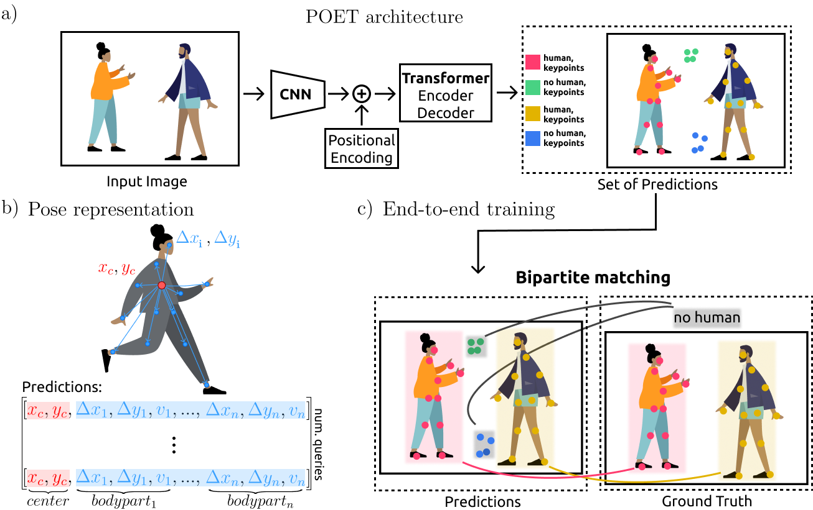

**POET**: End-to-End Multi-Instance Pose Estimation with Transformers
========
This repository contains the official implementation of **POET** (**PO**se **E**stimation **T**ransformer) and is build built on top of [DETR](https://github.com/facebookresearch/detr).
We replace the full complex hand-crafted pose estimation pipeline with a Transformer, and outperform Associative Embedding with a ResNet-50, obtaining **54 mAP** on COCO. Inference in 50 lines of PyTorch.

For details see [End-to-End Trainable Multi-Instance Pose Estimation with Transformers](https://arxiv.org/abs/2103.12115) by Lucas Stoffl, Maxime Vidal and Alexander Mathis.

# Notebooks

We provide a few notebooks to help you get a grasp on POET:
* [POET's notebook](): Shows how to load a pre-trained model, generate predictions and visualize the attention of the model.

# License
POET is released under the Apache 2.0 license. Please see the [LICENSE](LICENSE) file for more information.

